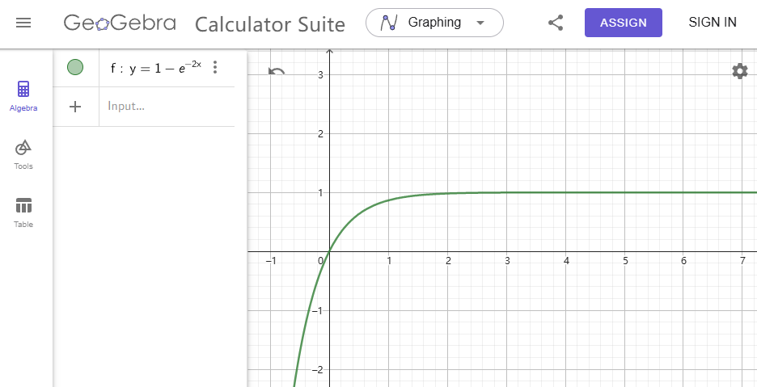

# UCB-Calculator
一个通过LLLL三卡池抽卡模拟来演示UCB(上置信界)算法在多臂赌博机中应用的网页应用

我们以一个手游中常见的抽卡情形来详细演绎这个问题:

假设当期同时开放了3个不同的卡池,你可以花费200资源进行一次抽卡.抽卡的结果按照卡牌稀有度依次划分为:R→SR→UR→卡池限定UR.假设每个稀有度的卡牌在每个卡池出现概率是恒定的(恒定:不会随之前的抽卡结果产生修正),并且玩家事先并不知道这些概率的具体值.如果现在玩家手上一共有60000资源,也就是说可以进行300次抽卡.他想要利用好这些资源将抽卡的结果最优化,即能抽到尽可能多的高稀有度卡牌.

## 简单的算法

显然,一个简单的切入点是在抽了几次卡后根据结果得到经验来预估这个卡池中每个稀有度卡牌的出现概率.假设现在对一号卡池进行了一次十连抽,得到了6张R,3张SR和1张UR(不是卡池限定UR).那么就可以对该卡池做出如下预估:

| 稀有度      | R    | SR   | UR   | 限定UR |
| ----------- | ---- | ---- | ---- | ------ |
| 出现概率(%) | 60   | 30   | 10   | 0      |

为了便于之后的叙述,用出货率$p$来指代某个目标稀有度卡牌(根据玩家需求而定)的出现概率,对其估计的计算公式如下:
$$
\hat p=\frac{H(n):目标稀有度卡牌累计出现次数}{n:当前抽卡次数}
$$
将其推广到多个卡池,可以得到以下的简单步骤:

1. 立刻对所有卡池进行一次十连抽(不考虑任何额外的保底情况),并且分别统计每个卡池的出货率
2. 根据初始结果,选择出货率最高的卡池继续抽卡(如果有多个最优卡池则随机选择一个)
3. 根据新的抽卡结果重新计算每个卡池的收益
4. 重复抽卡和计算过程,直到耗尽所有的资源.

在以上过程中,1和3完成的任务是探索:根据抽卡的结果反馈实时调整预估出货率$\hat p$.当$n$足够大时,$\hat p$就会越趋近于$p$.2完成的任务则是利用:根据当前的最优结果来确定下一步的抽卡方向.

虽然这个算法比较简洁明了,但是其也有很明显的缺点,就是容易得到**局部最优解**.尤其是当目标是抽稀有度更高的卡(更低的概率)时,这种情况会更为明显.考虑以下情形:假设三个卡池的实际UR出现概率分别为[0.02,0.01,0.05].在第一轮十连抽中只有一号卡池抽出了1张UR而剩下两个卡池都没有出货,那么初始得到的概率为[0.1,0,0].这样一来,玩家就会不断的去尝试一号卡池,而忽视了二三号卡池可能拥有更高的出货率,即便他们一开始并没有出货.

抽卡的问题就是在权衡探索与利用问题的一个例子,玩家需要平衡什么时候应该探索新的卡池,什么时候保持抽当前的最优卡池.这个时候就需要引入**上置信界(upper confidence bound,UCB)算法**来解决这一问题了.

## 上置信界算法

上置信界(upper confidence bound,UCB)算法,又称置信区间上界算法.它的思想是:显然,当前出货率高的卡池是有高利用价值的,不确定性高的卡池是有高探索价值的.如果能综合这两种价值,给每种卡池一个评分,我们就可以根据卡池的评分高低来决定下一抽选择的卡池.

某个卡池的"利用价值"显然可以使用当前卡池的预估出货率来衡量,而"探索价值"可以用这个卡池的某种不确定性度量来衡量.而卡池的最终评分,最简单的方法就是用两个价值的和来表示.也就是说:

$$
R:卡池评分 = \hat p:预估出货率 + ?:不确定性度量
$$
预估出货率的计算方式已经在简单算法中介绍过,因此下一步的目标是找到办法计算一个卡池的不确定性度量.

假设某个卡池的真实出货率为$p$,现在已经在这个卡池上抽了$n$发,其中$H(n)$发出货,那么根据之前的计算公式可以预估出货率$\hat{p}=\frac{H(n)}{n}$.很显然当$n\rightarrow +\infty$时会有$\hat p \rightarrow p$.但是因为资源有限,我们不可能无限制地抽卡,因此$\hat p$与$p$之间必然会存在一个误差,记为$\delta$.假设能找到这样的一个$\delta$,使得$|p-\hat p|\leq\delta$恒成立,那么$\hat p+\delta$就是真实出货率$p$的上置信界.在$\hat p$已知的情况下,$\delta$越大则意味着$p$的浮动范围越大,即不确定性越高,因此$\delta$可以作为卡池的不确定性度量.

最后需要解决的问题就是如何计算$\delta$,这就需要引入**霍夫丁不等式(Hoeffding's inequality)**来进行推导了.

### 霍夫丁不等式

在概率论中,霍夫丁不等式适用于有界的随机变量,提供了有界独立随机变量之和偏离其期望超过一定数量的概率的上限,因此在伯努利随机变量特例中可以被用于推导置信区间.假设某个卡池的真实出货率为$p$,现在对这个卡池抽卡$n$次,则可以产生$n$个抽卡结果作为样本:$X_1,X_2,\dots,X_n$.这些样本是独立同分布的伯努利随机变量.抽卡出货的期望为$np$.更进一步的,至少出货$k$次概率可以通过以下公式精准量化:
$$
\mathbb{P}(H(n)\geq k)=\sum^n_{i=k}C_n^i\cdot p^i(1-p)^{n-i}
$$
其中$H(n)$是$n$次抽卡后的出货数量.对于某$\delta>0$,有$k=(p+\delta)n$,此时霍夫丁不等式将这个概率限制在一个在$\delta^2n$中呈指数小的项:
$$
\mathbb{P}(|H(n)-pn| >\delta n)\leq e^{-2\delta^2n}
$$
这意味着我们看到的头部数量集中在其均值周围,尾部呈指数级小.如果将目标条件不等式的两侧同时除以$n$再作适当变形,则有:
$$
\mathbb{P}(|p-\hat p|\leq\delta)\geq 1-e^{-2\delta^2n}
$$
现在括号中的条件正是我们需要的:即找到一个$\delta$使得括号中的这个条件恒成立.但是通过不等式可以看出恒成立是困难的,因此我们的目标转变为了让这个条件成立的概率在右式函数值域$[0,1)$范围内尽可能地大.

从图像来看,$1-e^{-2\delta^2n}$关于$\delta$单调递增,所以很容易想到取$\delta\rightarrow+\infty$.但是这样一来就丧失了其作为附加量度的意义.因为在这种情况下,任何卡池都能满足括号内的条件恒成立.

不妨借助当前的总抽卡次数$N$(由于一定在最开始对每个卡池进行过一次抽卡初始化,所以认定$N$>0),定义$\frac{N-1}{N}$​来动态表示这个"尽可能大"的概率.解以下方程:
$$
\frac{N-1}{N}=1-e^{-2\delta^2n}
$$
解得:
$$
\delta=\sqrt{\frac{\ln N}{2n}}
$$

观察这个式子不难发现:

- 当一直抽这个卡池时,$n$和$N$同时增长.分母的线性增长速度大过分子的对数增长速度,因此$\delta$越来越小直到$\delta\rightarrow 0$.这意味着随着越来越多次的抽卡,这个卡池的不确定性被降低,这个卡池的估计出货率的置信度变得很高,不再具有探索价值.
- 当一直不抽这个卡池时,$N$增长而$n$不增长.,因此$\delta$越来越大直到$\delta\rightarrow +\infty$.这意味着随着越来越多次的抽卡,这个卡池的不确定性升高了,这个卡池的估计出货率的置信度变得很低,有很大的探索价值.

### 选择策略

综合以上分析,我们最后给出如下的公式来计算每个卡池的评分:
$$
R=\frac{H(n)}{n}+\sqrt{\frac{\ln N}{2n}}
$$
其中各符号解释如下表所示:

| 符号   | 说明                     |
| ------ | ------------------------ |
| $R$    | 卡池评分(也就是上置信界) |
| $n$    | 当前卡池的出货次数       |
| $H(n)$ | 当前卡池的抽卡次数       |
| $N$    | 所有卡池的抽卡总次数     |

考察每个卡池的上置信界,因此每次选取最高的上置信界卡池抽卡即可.